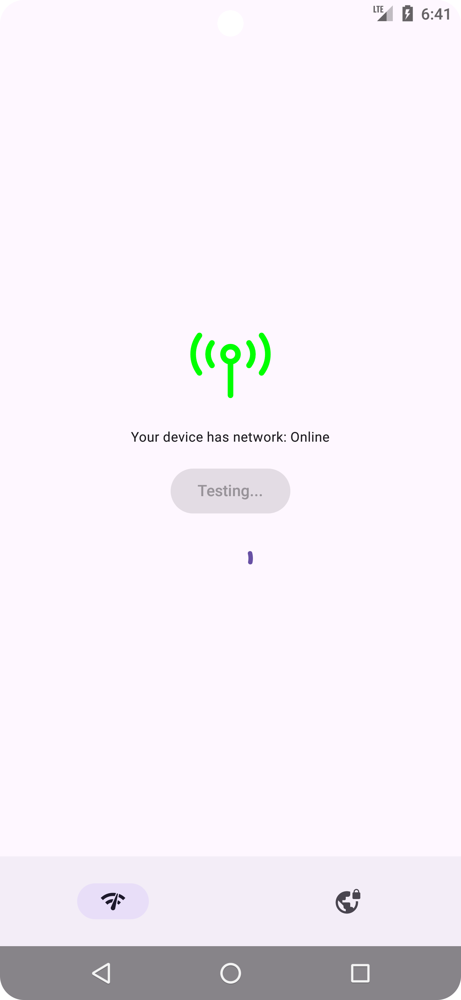

# Android Network Connectivity & Speed Test Sample App

This is a simple Android sample app designed to demonstrate the following functionalities:

- **Network Connectivity State**: Displays the current network connectivity state of the device (Online/Offline).
- **Download and Upload Speed Test**: Measures the device's download and upload speeds using a demo URL. This is a basic speed test functionality for educational purposes.
- **Simple List Screen**: Displays a simple list of items. When an item is clicked, a toast message is shown.

## Features:
- **Network Connectivity Check**: Displays whether the device is connected to a network (Online/Offline).
- **Speed Test**: Measures the download and upload speed using demo URLs (for demo purposes only).
- **List Screen**: A simple list of items that shows a toast when an item is clicked.

## Screenshots:

| col 1                                                                             | col 2                                                                             |
|-----------------------------------------------------------------------------------|-----------------------------------------------------------------------------------|
|  |  |
|  |  |

## Important Notes:
- This app is designed to support devices running **Android 21 (Lollipop)** and later.
- The URLs used for measuring speed are **only for demo purposes**. For apps requiring critical network performance measurements, it is highly recommended to use your own server to ensure the reliability of the speed tests.
- **For a more robust solution** supporting a wider range of Android versions and to avoid dealing with deprecated or varying network APIs, the use of **NDK (Native Development Kit)** is recommended. This allows the app to perform network tasks in native code, ensuring better compatibility and avoiding inconsistencies across Android versions.

## Tools for NDK Integration:
- **NDK (Native Development Kit)**: Used to handle low-level network connectivity functions in a more consistent and reliable manner.
- **C/C++**: The languages commonly used to write native code for network management tasks.
- **JNI (Java Native Interface)**: Allows communication between Java/Kotlin and native code (C/C++).

## NDK Libraries and Tools:
- **libc**: Standard C library that provides essential functions for networking tasks, such as socket programming.
- **libssl**: Provides SSL/TLS encryption for secure network connections, ensuring your app’s network operations are encrypted.
- **libcurl**: A popular library to handle network requests (HTTP/HTTPS), which can be used for download/upload speed tests.
- **libandroid**: Contains the Android-specific parts of the NDK, such as accessing system-level features for connectivity.
- **Netd**: Android's network daemon, which can be accessed via NDK for more control over networking features like connectivity monitoring.

These libraries can help in managing and optimizing the network operations in your app, ensuring that you have more granular control over network connectivity and speed testing while avoiding the limitations of Java/Kotlin APIs.

## Requirements:
- Android 21+ (Lollipop) and later.
- **NDK** (Native Development Kit) setup for enhanced network operations (optional).
- **Android Studio** with NDK support enabled.

## How to Run:
1. Clone this repository to your local machine.
2. Open the project in **Android Studio**.
3. If using NDK, ensure that you have the NDK setup in your Android Studio project.
4. Run the app on an emulator or a physical device.

